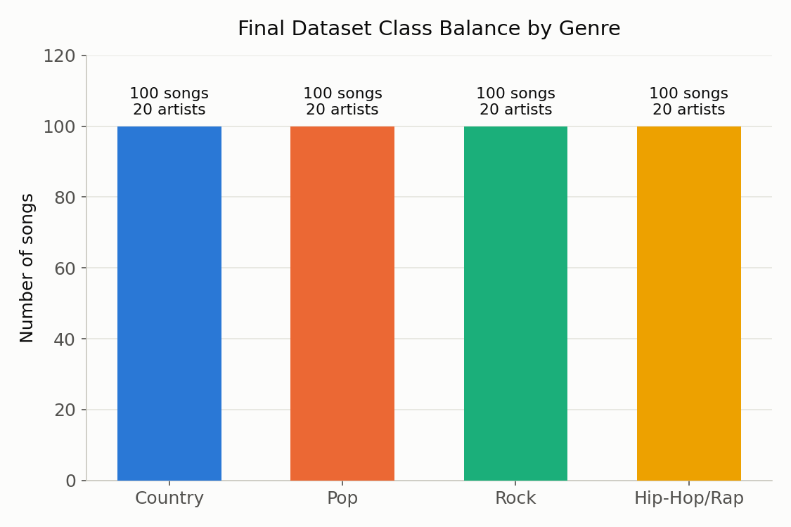
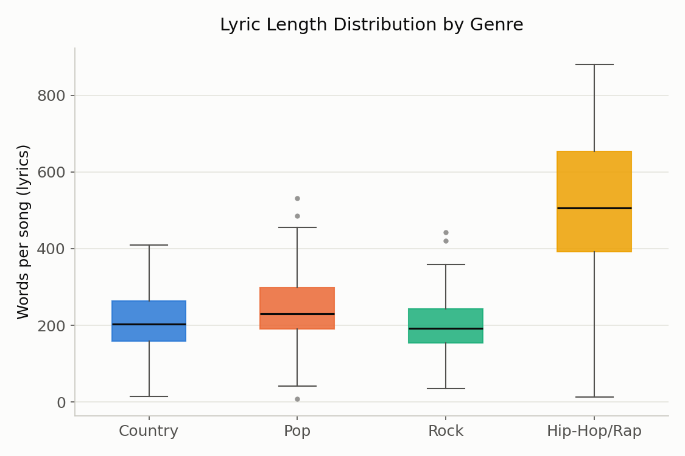

# DATA Folder Metadata

This file documents the data used in the Lyrical Classification of a Song's
Genre project: where it came from, how it was filtered, its known
limitations, and the meaning of every column in the final dataset. It
describes the **final, 400-song dataset** (`music_genre_dataset_final.csv`)
produced by `SCRIPTS/04_collect_dataset.py` and `SCRIPTS/05_backfill_country.py`,
not the smaller pilot dataset explored earlier in the project.

## Data Summary

The final dataset contains 400 songs evenly split across four genres:
Country, Pop, Rock, and Hip-Hop/Rap (100 songs each). Each genre contains 20
artists, with every artist contributing exactly 5 songs. Every row pairs a
song's plain-text lyrics with a single project-assigned genre label, along
with the MusicBrainz/LRCLIB identifiers needed to trace that row back to its
source recording and lyric match.

Three CSV files are provided, representing successive stages of the
collection pipeline:

- `music_genre_dataset_raw.csv` — candidate songs selected from MusicBrainz, before lyric retrieval.
- `music_genre_dataset_with_lyrics.csv` — the same candidates after LRCLIB lyric retrieval, before language filtering.
- `music_genre_dataset_final.csv` — the final, class-balanced, English-only dataset used for modeling.

This is a larger, more permissively filtered dataset than the pilot dataset
explored earlier in the project (which used a 10,000-listener popularity
threshold and 3 songs per artist across 47-60 songs). The final dataset
lowers the popularity threshold to 1,000 unique listeners and increases
each artist's contribution to 5 songs, in order to reach the project's
400-song target while keeping every genre balanced.

## Provenance

Song and artist candidates were obtained from the MusicBrainz database using
recording searches based on tags for each genre (`country` for Country;
broader tag families for Pop, Rock, and Hip-Hop/Rap, e.g. `pop`,
`dance-pop`, `electropop`, `synthpop` for Pop). For each genre tag, up to 500
candidate recordings were retrieved (MusicBrainz's maximum reachable
offset+limit), and duplicate recording IDs were removed.

Artists were required to have at least 8 candidate songs in the pool
(so that a lyric or language miss on one or two songs would not disqualify
the artist), and multi-artist credits (collaborations/features) were
excluded from the artist selection pool, keeping only single-credited
artists. ListenBrainz popularity data was then used to require at least
1,000 unique listeners per artist. This lower bound (versus the 10,000
used in the pilot dataset) was needed to reach the full 20-artists/genre
target; requiring popularity at all was still necessary because more niche
artists frequently did not have lyrics published for their songs. This
popularity filter can introduce bias, which is discussed further in Ethical
Considerations below.

Twenty qualifying artists were randomly selected within each genre using a
fixed random seed of 4002, followed by random selection of 5 songs per
artist. Plain-text lyrics were retrieved through the LRCLIB API. Failed
lyric requests were retried individually, because exploratory collection
showed that temporary API failures could cause otherwise-available lyrics
to be reported as missing. The resulting lyrics were screened for language
using `langdetect` with a fixed seed of 4002, and the final dataset was
restricted to songs with retrievable, English-language lyrics.

The initial "country" tag search alone under-filled the Country genre
(only ~13-15 eligible artists survived the popularity/lyrics/language
filters, short of the 20-artist target hit by the other three genres).
`SCRIPTS/05_backfill_country.py` widens the Country tag search and repeats
the same popularity -> lyrics -> language pipeline to backfill additional
Country artists, so that the final dataset ends up balanced at 100 songs /
20 artists for every genre.

## License

The code in this repository (scripts, notebooks, and the web app) is
released under the MIT License (see `LICENSE.md` at the repository root).

The **lyric text itself is not covered by this license.** Song lyrics are
copyrighted creative works owned by their respective songwriters and
publishers; they are included here only as material for academic text
analysis (feature extraction, classification), not as openly licensed
content for redistribution or commercial reuse. Metadata such as song
titles, artist names, and MusicBrainz/LRCLIB identifiers is treated as
factual reference data rather than a creative work.

## Ethical Statements

- **Copyrighted material.** Song lyrics are copyrighted creative works, so
  this project treats the lyric text as material for academic text analysis
  rather than openly licensed content for redistribution.
- **Imperfect genre labels.** Genre labels come from the MusicBrainz tag
  used to sample each song and are imperfect: MusicBrainz tags are
  community-generated, and an individual song can plausibly belong to
  multiple genres. `target_genre` should be read as "the genre this song
  was sampled under," not a claim of exclusive genre identity.
- **Popularity-driven sampling bias.** Requiring a ListenBrainz popularity
  threshold (1,000+ unique listeners) favors more established, mainstream
  artists and reduces the representation of niche or emerging musicians.
  This was necessary because niche artists' lyrics were often unavailable
  on LRCLIB, but it means the dataset is not representative of each
  genre's full artist population.
- **English-only scope.** Restricting the final dataset to English-language
  lyrics (via `langdetect`) limits any conclusions drawn from this project
  to English-language songs; genre-lyric relationships in other languages
  are outside its scope.
- **Sensitive language.** Lyrics may contain profanity, slurs, or other
  sensitive language. Such terms remain part of the analytical text used
  for modeling unless a specific preprocessing step removes them. A small,
  display-only filter was applied when producing exploratory TF-IDF term
  figures, so that explicit terms were not unnecessarily emphasized in the
  written report -- this filter affects only how results are displayed, not
  the text used to train the model.

## Data Dictionary

All three CSV files in this folder share the same core columns; the raw
file has fewer columns because it is captured before lyric retrieval.

| Column | Description | Uncertainty / Notes |
|---|---|---|
| `recording_id` | Unique MusicBrainz identifier for the recording. | MusicBrainz recordings can occasionally be merged or updated. |
| `song_title` | Recording title as returned by MusicBrainz. | May include version labels such as live, instrumental, or alternate versions. |
| `artist` | Credited artist name. | Multi-artist credits (collaborations/features) were excluded from artist selection. |
| `artist_id` | MusicBrainz artist identifier. | Used to query ListenBrainz popularity. |
| `musicbrainz_tags` | Community-provided MusicBrainz tags associated with the recording. | Tags are user-generated and may be subjective or overlap across genres. |
| `target_genre` | Project-assigned genre: Country, Pop, Rock, or Hip-Hop/Rap. | Based on the genre tag search used for sampling; not necessarily an exclusive genre identity. |
| `lrclib_artist` | Artist name returned by LRCLIB for the matched lyric result. | Used to sanity-check whether the returned result corresponds to the requested song. |
| `lrclib_title` | Song title returned by LRCLIB. | May differ slightly in formatting from the MusicBrainz title. |
| `lyrics` | Plain-text song lyrics retrieved from LRCLIB. | Missing for songs without a successful match; copyrighted text -- see Ethical Statements. |
| `lyrics_found` | Boolean indicating whether lyrics were successfully retrieved. | Temporary API failures caused some songs to require a retry during collection. |
| `language` | Language predicted from the retrieved lyric text (via `langdetect`). | Automatically detected and therefore subject to classification error. |

`recording_id` through `target_genre` are present in all three files.
`lrclib_artist` through `language` are added once lyric retrieval runs
(present in `music_genre_dataset_with_lyrics.csv` and
`music_genre_dataset_final.csv`, absent from `music_genre_dataset_raw.csv`).

`word_count` (words per song, computed by splitting `lyrics` on whitespace)
is used in the explanatory plot below and in exploratory analysis, but is
not a stored column in the CSV files -- it is derived on the fly from
`lyrics` since repeated choruses remain part of the count.

## Explanatory Plots

**`genre_class_balance.png`** — confirms that the final dataset is exactly
balanced: 100 songs and 20 artists for each of the four genres. This
balance is a design goal of the collection pipeline (`SCRIPTS/04_collect_dataset.py`
and `SCRIPTS/05_backfill_country.py`), not an incidental property of the raw
MusicBrainz/ListenBrainz pool, which is why it's worth confirming directly
on the final CSV.

**`lyric_length_by_genre.png`** — shows the distribution of lyric word
count by genre. Hip-Hop/Rap songs are substantially longer (median ~505
words) and more variable than the other three genres (medians ~190-230
words), which are fairly similar to each other. This asymmetry is a useful
signal for the downstream classifier: it partially explains why Hip-Hop/Rap
is the easiest genre for the TF-IDF + logistic regression model to
separate from the rest (see `OUTPUT/model_metrics.txt`).

